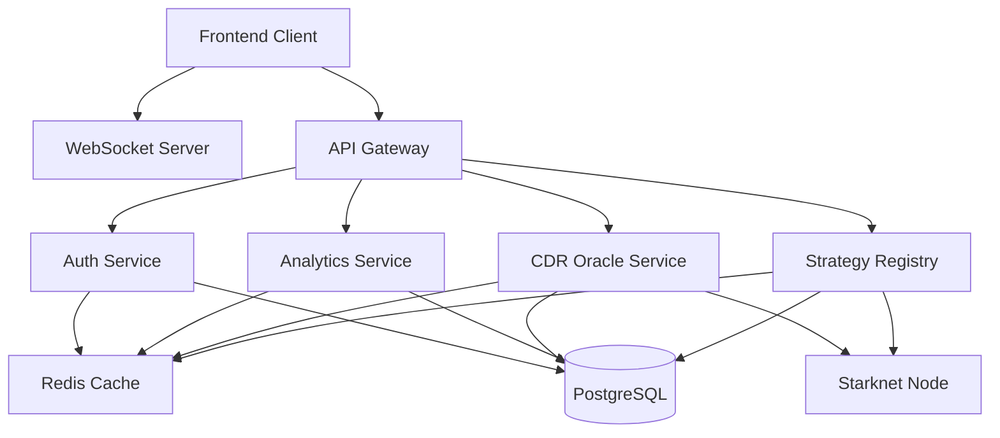
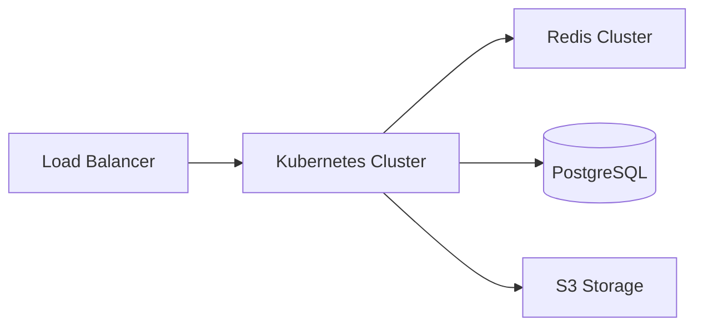
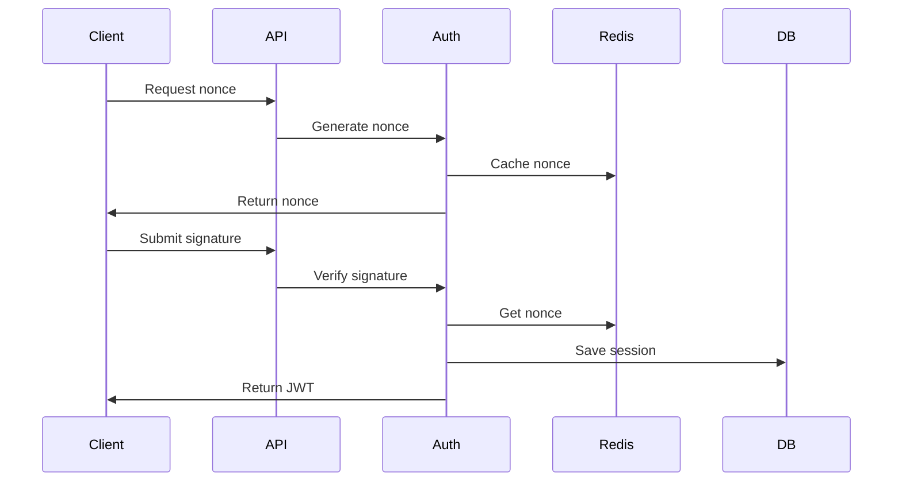
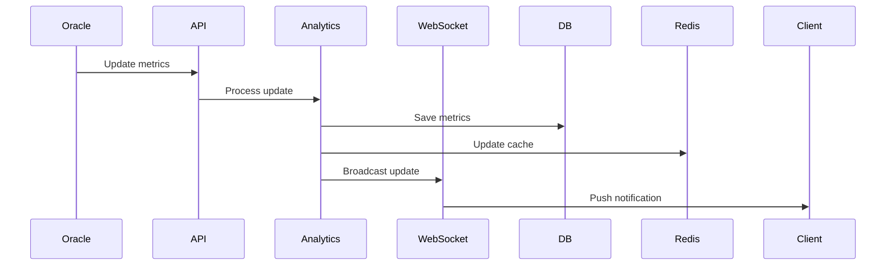
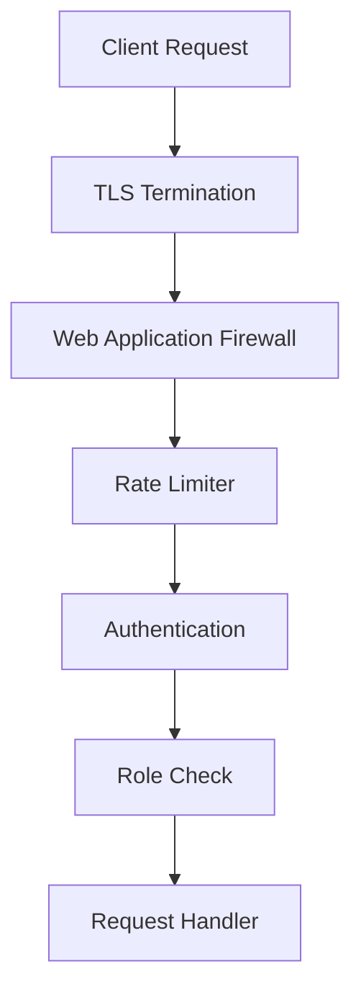
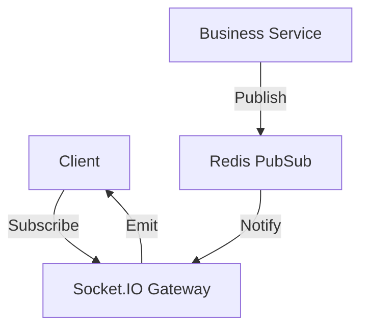
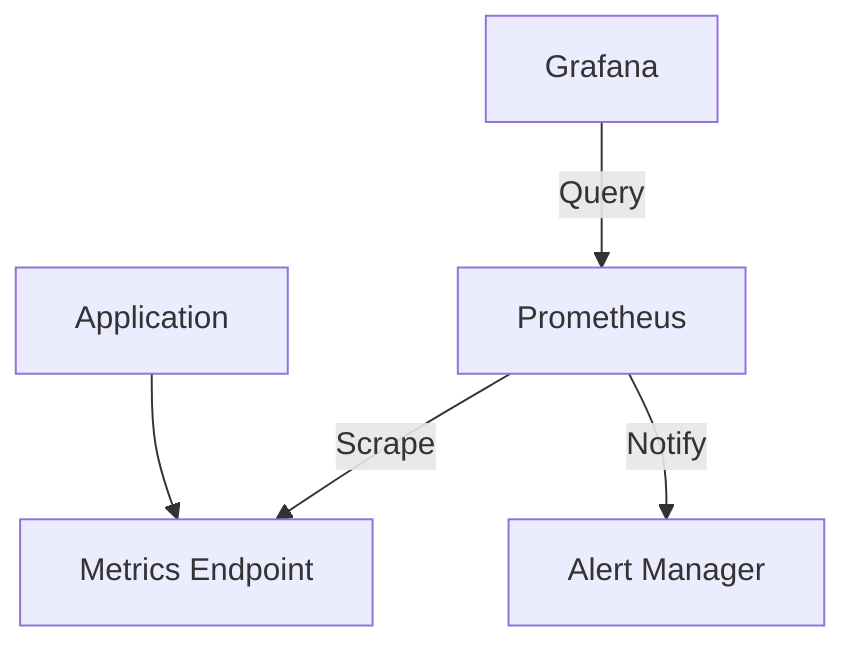
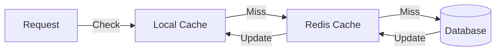

# Kanaka Protocol Backend Architecture

## Overview

The Kanaka Protocol backend is a modular, scalable NestJS application that serves as the API layer between the frontend and the blockchain infrastructure. It handles user authentication, analytics, and interaction with the Starknet smart contracts.

## System Architecture

## Module Architecture

### Core Modules

1. **Authentication Module**
   - Wallet signature verification
   - JWT token management
   - Role-based access control
   - API key management

2. **Analytics Module**
   - Pool metrics tracking
   - Correlation analysis
   - CDR (Crypto Drawdown Risk) calculations
   - Real-time metrics updates

3. **CDR Oracle Module**
   - Pool risk assessment
   - Volatility tracking
   - Yield rate monitoring
   - Cross-pool correlation tracking

4. **Strategy Registry Module**
   - Pool management
   - Strategy deployment
   - Portfolio rebalancing
   - Yield optimization

### Support Modules

1. **Common Module**
   - Guards
   - Interceptors
   - Filters
   - Decorators
   - DTOs
   - Interfaces

2. **Database Module**
   - TypeORM configuration
   - Migrations
   - Entities
   - Repositories

### Infrastructure

## Data Flow

### Authentication Flow

### Analytics Update Flow

## Security Architecture

### Authentication Layers

1. **Network Level**
   - TLS encryption
   - Network policies
   - Rate limiting

2. **Application Level**
   - JWT validation
   - Role checking
   - Request signing

3. **Data Level**
   - Field encryption
   - Data masking
   - Audit logging

### Security Flow

## Real-time Updates Architecture

### WebSocket Integration

## Monitoring Architecture

### Health Checks

1. **Liveness Probe**
   - Basic application health
   - Memory usage
   - Event loop latency

2. **Readiness Probe**
   - Database connectivity
   - Redis connectivity
   - External services

3. **Metrics Collection**
   - Request rate
   - Error rate
   - Response time
   - Resource usage

### Monitoring Flow

## Cache Architecture

### Cache Layers

1. **Application Cache**
   - Request results
   - Computed values
   - Session data

2. **Distributed Cache**
   - Shared state
   - Rate limiting
   - Lock management

### Cache Flow

